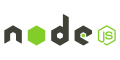

## Hi there 👋

I'm a software engineer from Iran.

### What I do

I build mobile applications with Flutter and Dart. Most of my work is focused on Android development, where I enjoy turning ideas into smooth, usable apps.

## My skills 📜

### Web technologies

- JavaScript
- Next.js
- HTML, CSS
- Node.js 

### Android Development

- Flutter
- Kotlin

### Productivity utilities

- Microsoft Office

### Languages 🌐

| Language      | Proficiency                                                               |
| ------------- | ------------------------------------------------------------------------- |
| English | B1 
| Persian         | Native language                                                           |

<h2 align="left" id="macropower-tech">Favorite Tech</h2>

> Tools, languages, and other things that I like to work with.

<table>
  <tr>
    <td align="center" width="96">
      
       Dart
    </td>
    <td align="center" width="96">
      
       Flutter
    </td>
       <td align="center" width="96">
      
       Js
    </td>  
    </td>
       <td align="center" width="96">
      
       NodeJs
    </td> 
  </tr>
</table>

<!--  -->
<!--
**mmdpuff/mmdpuff** is a ✨ _special_ ✨ repository because its `README.md` (this file) appears on your GitHub profile.

Here are some ideas to get you started:

- 🔭 I’m currently working on ...
- 🌱 I’m currently learning ...
- 👯 I’m looking to collaborate on ...
- 🤔 I’m looking for help with ...
- 💬 Ask me about ...
- 📫 How to reach me: ...
- 😄 Pronouns: ...
- ⚡ Fun fact: ...
-->
